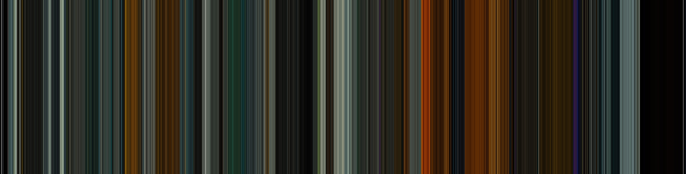

"Colors, like features, follow the changes of the emotions." —  Pablo Picasso

In 2000, Jason Salavon's "The Top Grossing Film of All Time, 1 x 1"
(https://www.artic.edu/artworks/185355/the-top-grossing-film-of-all-time-1-x-1) attempted to averaged each frame of the movie "Titanic" to a single color and laid the entire film out, frame by frame, and created an abstract representation of the entire film. Movies make use of color to convey certain emotion or atmosphere for the audience. This Python code is based on work by Andrew Campbell (https://github.com/andrewdcampbell/movie-barcodes), which creates a color sequence of frames from a mp4 movie file and with one additional feature: the resulting color sequence is rearranged from a sequential order (time)  to HSL color space order. This way, the color components of different movies can be in a more meaningful way. Each movie has its own HUE color sequence, and thus a DNA. 

Blade Runner (1982) - Color Sequence

Blade Runner (1982) - Color DNA

Blade Runner 2049 (2017) - Color Sequence

Blade Runner 2049 (2017) - Color DNA

